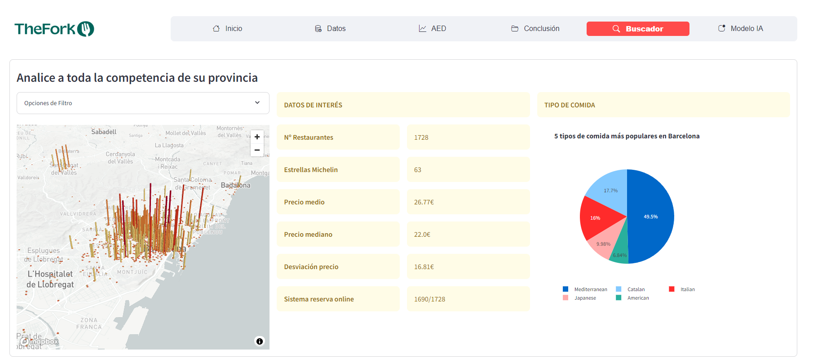

# Proyecto AED: Análisis del Precio Medio de Restaurantes en España 🍽️📊

## Componentes

- Kento Kamakura Gimeno
- Daniel Hernando Graboleda
- Pablo Lucas Mora
- Miguel Gil Jimenez

## Descripción

Este repositorio contiene los archivos y el código relacionados con el proyecto de Análisis sobre las variables que influyen en el precio medio de los restaurantes en España. Este proyecto se ha realizado como parte de la asignatura de **Proyecto** de **Ciencia de Datos** de la **Universitat Politècnica de València**

## Estructura del Repositorio

- **Documentacion/**: Documentación e informes del desarrollo del proyecto (Adquisición y Limpieza de Datos, AED, Cronograma)
- **Datos/**: Código del webscraping y datos obtenidos
- **Informe_Proyecto.pdf**: Informe Final entregable para la evaluación de la asignatura
- **Webconfig/**: Código de configuración de la aplicación web. Imágenes y datos de la web.
- **README.md/**: Documento actual
- **main.py/**: Ejecutable de la web

## Objetivo del Proyecto
- Conseguir Base de Datos de precio medio por restaurante con un mínimo de 5000 datos
- Conseguir Base de Datos demográfica por provincias en España​
- Analizar qué características influyen más en el precio medio de un restaurante.
- Desarrollar un buscador de restaurantes dadas ciertas características del restaurante
- Integrar todo el AED, Conclusiones y Soluciones tecnológicas en una única página web​

## Tecnologías Empleadas

- Adquisición y Limpieza de Datos: *Python, Selenium, Requests*
- Análisis Exploratorio de Datos (AED): *Python, Statgraphics*
- Desarrollo Web: *Python, Streamlit, Plotly*

## Notas

Este proyecto se ha desarrollado como parte de un trabajo académico para la asignatura de Proeycto de la UPV. Los datos utilizados son de acceso público y se han manipulado únicamente con fines educativos y de investigación.


# Accede a nuestra página web!
[Accede mediante ese enlace](https://thefork.streamlit.app/)


# ¿Cómo ejecutar la página web al copiar el repositorio?
```
pip install -r requirements.txt
streamlit run main.py
```